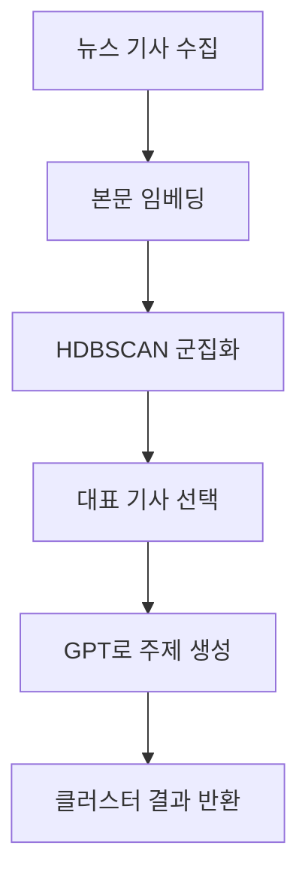

# 📄 뉴스 기사 군집화 및 요약 PRD

## 1. 목적

뉴스 기사 본문만을 입력으로 받아,
- 유사 주제 기사들을 자동으로 클러스터링하고
- 각 클러스터의 대표 제목 및 요약을 생성하여  
사용자에게 정보 탐색에 최적화된 주제 단위 결과를 제공한다.

---

## 2. 주요 기능

### ✅ 1. 기사 임베딩
- 사용 모델: `sentence-transformers/paraphrase-multilingual-MiniLM-L12-v2` (HuggingFace)
- 입력: 기사 본문 리스트 `List[str]`
- 출력: 벡터 리스트 `List[float[]]` (512차원)

### ✅ 2. 군집화
- 알고리즘: `HDBSCAN`
- 특징: 자동으로 최적의 클러스터 수 결정
- 출력: `{문서 ID → 클러스터 ID}` 매핑

### ✅ 3. 대표 기사 선정
- 각 클러스터의 중심에 가까운 기사 1~3개 선정
- 유사도 기준: 클러스터 내 cosine similarity 평균 최대값

### ✅ 4. 제목 및 요약 생성 (LLM 활용)
- 모델: OpenAI GPT-4o 또는 GPT-3.5
- 프롬프트 예시:

다음 뉴스 기사들을 바탕으로 공통 주제를 요약하고,
제목과 함께 간단한 설명을 만들어주세요.
- 출력 예시:
- 제목: "트럼프 취임 연설"
- 요약: "트럼프 대통령의 첫 연설을 다룬 기사들을 중심으로 구성된 클러스터입니다."

---

## 3. 입력/출력 예시

### ✅ 입력
```json
[
    {"id": "1", "content": "트럼프는 취임식 연설에서 미국 우선주의를 강조했다..."},
    {"id": "2", "content": "도널드 트럼프의 첫 연설, 전문가들은 경제 보호주의 강화로 해석..."}
]
```

### ✅ 출력
```json
[
  {
    "cluster_id": 0,
    "articles": ["1", "2"],
    "topic_title": "트럼프 취임 연설",
    "topic_summary": "트럼프의 취임 후 첫 연설과 그에 대한 해석 및 반응을 다룬 기사 클러스터"
  }
]
```

---

## 4. 시스템 구성도



---

## 5. 기술 스택

- 임베딩 : HuggingFace SentenceTransformer
- 군집화 : HDBSCAN
- 요약 생성 : OpenAI GPT API
- API 서버 : FastAPI 또는 Flask
- 캐싱 : FAISS 또는 DiskCache

---

## 6. 성능 및 확장성 목표

- 처리 시간: 1천 건 이하 기사 → 10초 내 처리
- 비용 최적화: 임베딩은 로컬 실행, GPT 호출은 대표 기사로만 제한
- 확장:
- 다국어 뉴스 대응
- 프론트엔드 HTML 카드 연동
- 키워드 기반 트렌드 분석 지원

